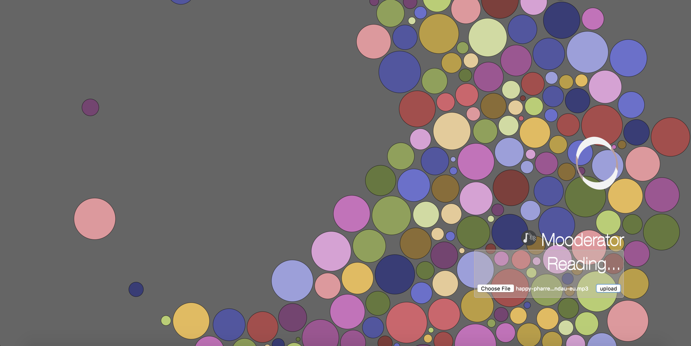

# Mooderator (PSYCH 186B - Winter 2018 - Final Project)

A web app for procedurally generated music visualization and categorization by mood.



## Getting Started

These instructions will get you a copy of the project up and running on your local machine for development and testing purposes.

### Prerequisites

Python 2.7 and pip installer

Make sure you have the following packages installed:

```
sudo pip install --user csv
sudo pip install --user flask
sudo pip install --user numpy
sudo pip install --user json
sudo pip install --user tensorflow
sudo pip install --user keras
sudo pip install --user librosa
sudo pip install --user re
sudo pip install --user math
sudo pip install --user matplotlib
sudo pip install --user optparse
sudo pip install --user glob
```

If the console throws any other errors for packages not installed, simply run `sudo pip install --user {package_name}`

### Web App (with DNN classifier)

To get the web app (with DNN classifier) running on your local machine:

```
python server.py
```

Visit http://localhost:5000/colors in Chrome. 

On first run, the page will take some time to load (as it is initializing and training the DNN).

Drag and drop an audio file into the indicated box, and press upload. 

### LSTM Classifier

To test the LSTM classifier,

```
cd LSTM
python lstm_mood_classification.py
```


## Built With

* [Librosa](https://github.com/librosa/librosa/) - Python music analysis library
* [Flask](http://flask.pocoo.org/docs/0.12/) - Python web server framework
* [Tensorflow](https://www.tensorflow.org/api_docs/python/) - Python Machine Learning framework (DNN)
* [Keras](https://keras.io/layers/recurrent/) - Python Machine Learning framework (LSTM)
* [D3JS](https://github.com/d3/d3/wiki/Gallery/) - JavaScript library for visualizing data with HTML, SVG, and CSS.

### Version - 1.0

## Authors

* **Marshall Briggs** - marshallbbriggs@gmail.com
* **Kate Cook** - katecook1440@gmail.com
* **Noam Grebler** - greblernoam@gmail.com

